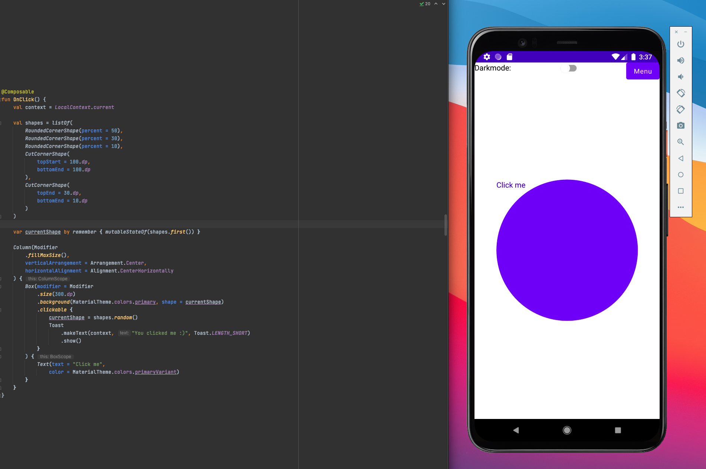
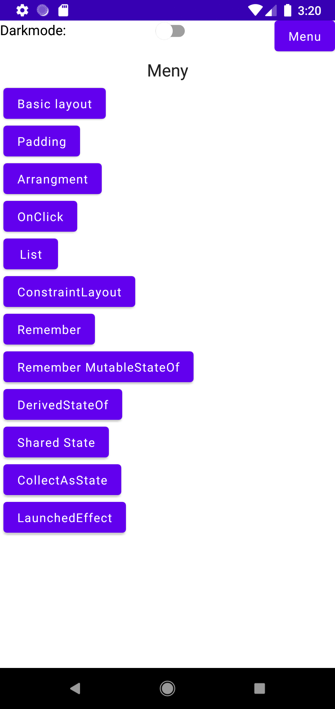

# Jetpack Compose Demo

This is an Android App made with [Jetpack Compose](https://developer.android.com/jetpack/compose "Jetpack Compose Homepage"). Apps purpose is to get bacis knowdledge of how to use Jetpack Compose with Android.

All code is in MainActivity.kt and with lof of new lines between @Compasables. This is done so you can show app and Android Studio at the same time if you present. Like this:

Small presentation is also included. Look in [presentation](./docs/ "Presentation"). Presentation is built with [Marp](https://github.com/marp-team/marp-vscode "Marp VS-Code")

## Content
- Darkmode toggle
- Basic Layouts
- Modifier
- Arrangment
- OnClick
- LazyColumn
- ConstraintLayout
- Remember
- Remember MutableStateOf
- DerivedStateOf
- Shared state
- CollectAsState
- LaunchedEffect
- NavHost

## Screenshot:
 "Main menu"

